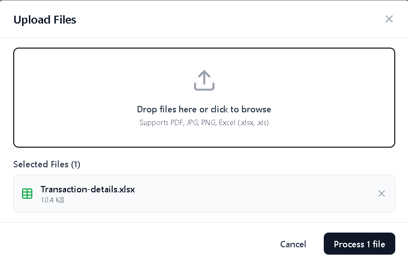
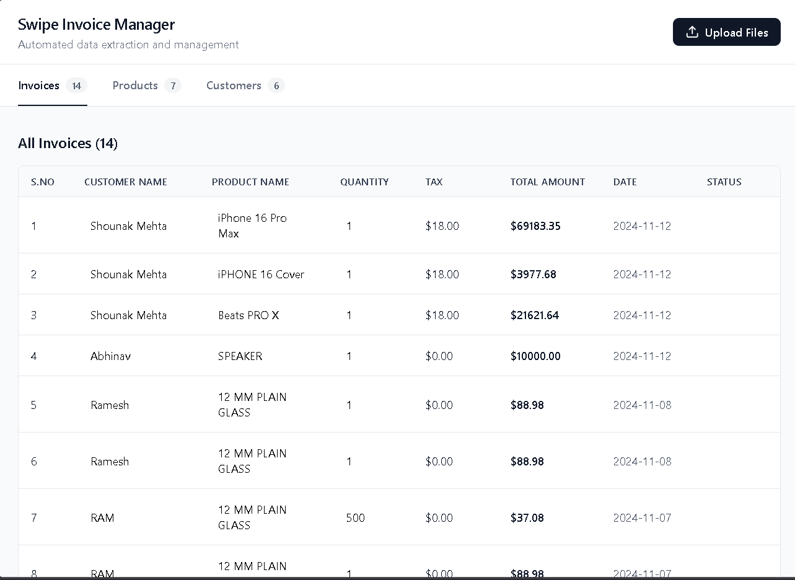
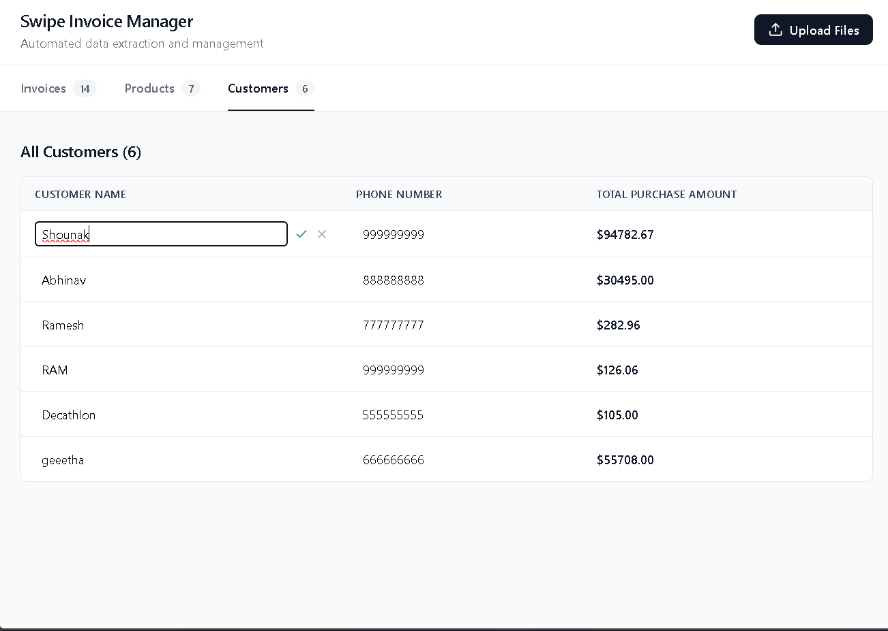

# Swipe Invoice Manager

A React + Redux Toolkit app that extracts and organizes invoice data from uploads (Excel, PDF, images) into synchronized Invoices, Products, and Customers tabs.

## Overview

- AI extraction via Google Gemini; XLSX parsing runs in-browser.
- Cross-tab sync: product/customer renames immediately update invoices.
- Inline editing with validation and missing-field highlights.
- Drag-and-drop uploads with previews.

## Screenshots

- File upload modal: 
- Invoices/Products/Customers tabs: 
- Inline editing & sync: 

## Capabilities

- File support: Excel ✅ (fully), Images ⚠️ (basic), PDF ⚠️ (graceful fallback; server/OCR recommended for production).
- Tabs: Invoices (serial, customer, product, qty, tax, total, date), Products (name, qty, unit price, tax, price with tax), Customers (name, phone, total purchase).
- State: Redux Toolkit slices with sync reducers for cross-tab updates.
- Validation: Missing fields flagged; inline edits to correct.

## Setup

1. Install: npm install
2. Env: create .env with VITE_GEMINI_API_KEY=your_key
3. Dev: npm run dev (http://localhost:5173)
4. Build: npm run build

## Usage

- Upload files, click Process, review data in tabs.
- Click any cell to edit; saves dispatch and sync across tabs.

## Test Coverage

- Case 3 (Excel): Pass
- Case 4 (Multiple Excel): Expected to pass
- Case 1/2/5 (PDF/Image): Partial (browser limitation; use Excel for accuracy)

## Known Limitations

- Browser PDF OCR is limited; use server-side parsing/OCR for production.
- Image OCR accuracy varies; consider dedicated OCR.

## Deployment

- Vercel ready: build with npm run build, serve dist/, set VITE_GEMINI_API_KEY.

## Attribution

Built for the Swipe Frontend Developer assignment.
